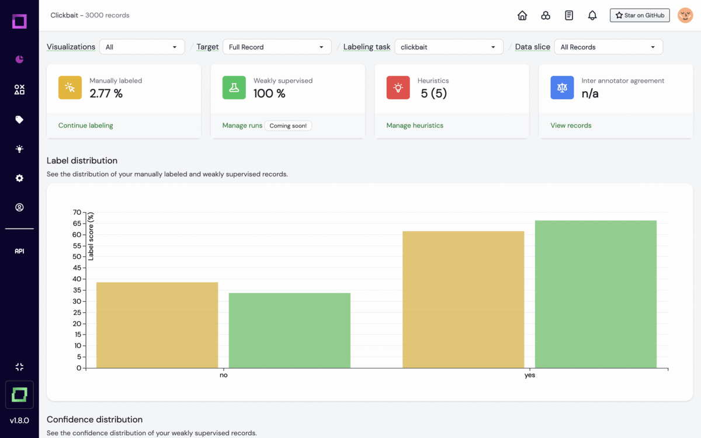
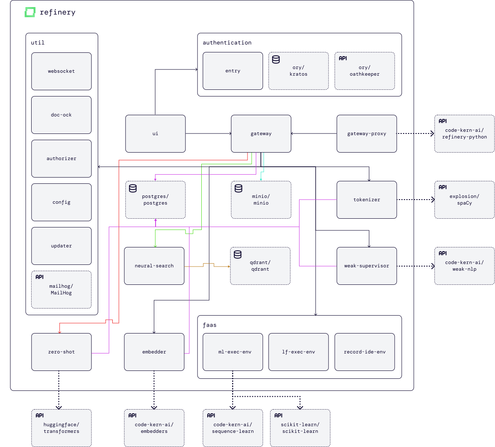

<p align="center">
    <b>Open-source data-centric IDE for NLP. Combining (semi-)automated labeling, extensive data management and neural search capabilities.</b>
</p>

<p align=center>
    <a href="https://github.com/code-kern-ai/refinery/blob/master/LICENSE"></a>
    <a href="https://discuss.kern.ai/"></a>
    <a href="https://discord.gg/qf4rGCEphW"></a>
    <a href="https://twitter.com/MeetKern"></a>
    <a href="https://www.linkedin.com/company/kern-ai"></a>
    <a href="https://www.youtube.com/channel/UCru-6X24b76TRsL6KWMFEFg"></a>
    <a href="https://github.com/code-kern-ai/refinery/projects/1"></a>
    <a href="https://app.kern.ai/"></a>
    <a href="https://docs.kern.ai/docs"></a>
    <a href="https://www.kern.ai/"></a>
</p>

Kern AI refinery (abbr. _refinery_) is like the data-centric sibling of your favorite programming environment. It provides an easy-to-use interface for weak supervision as well as extensive data management, neural search and monitoring to ensure that the quality of your training data is as good as possible.

_refinery_ doesn't get rid of manual labeling, but it makes sure that your valuable time is spent well.



_refinery_ consists of multiple microservices to enable a scalable and optimized workload balance, so this is the central repository used to orchestrate the system. It builds on top of [🤗 Hugging Face](https://www.huggingface.co) and [spaCy](https://spacy.io/) to leverage pre-built language models for your NLP tasks, as well as [qdrant](https://github.com/qdrant/qdrant) for neural search. Our microservices natively support GPU acceleration.

## Table of contents
- [Table of contents](#table-of-contents)
- [🧑‍💻 Why _refinery_? Built for developers with collaboration in mind](#-why-refinery-built-for-developers-with-collaboration-in-mind)
  - [Open-source and developer-oriented](#open-source-and-developer-oriented)
  - [For automation or quality control](#for-automation-or-quality-control)
  - [Improving collaboration with subject matter experts](#improving-collaboration-with-subject-matter-experts)
  - [Integrations](#integrations)
  - [Your benefits](#your-benefits)
- [🤓 Features](#-features)
  - [(Semi-)automated labeling workflow for NLP tasks](#semi-automated-labeling-workflow-for-nlp-tasks)
  - [Extensive data management and monitoring](#extensive-data-management-and-monitoring)
  - [Team workspaces in the managed version](#team-workspaces-in-the-managed-version)
- [🐳 Installation via Docker](#-installation-via-docker)
- [📘 Documentation and tutorials](#-documentation-and-tutorials)
- [😵‍💫 Need help?](#-need-help)
- [🪢 Community and contact](#-community-and-contact)
- [🙌 Contributing](#-contributing)
- [🗺️ Roadmap](#️-roadmap)
- [❓ FAQ](#-faq)
  - [Concept questions](#concept-questions)
  - [Technical questions](#technical-questions)
  - [Service and hosting questions](#service-and-hosting-questions)
- [🐍 Python SDK](#-python-sdk)
- [🏠 Architecture](#-architecture)
- [🏫 Glossary](#-glossary)
- [👩‍💻👨‍💻 Team and contributors](#-team-and-contributors)
- [📃 License](#-license)


## 🧑‍💻 Why _refinery_? Built for developers with collaboration in mind
There are already many other labeling tools out there, so why did we decide to build *yet another one*? 

### Open-source and developer-oriented
We believe that there is a lack of *open-source, developer-oriented* tools for data-centric NLP. In other terms: developers and scientists should be able to participate in the refinement of raw data to training data, but with the programmatic approach they love. That's why we made sure that integrations to tools like [🤗 Hugging Face](https://www.huggingface.co) and [spaCy](https://spacy.io/) are as easy as possible.


### For automation or quality control
The labeling workflow in _refinery_ is designed to integrate heuristics like labeling functions or active learning modules, which are combined via weak supervision. This way, you can either prototype the training data for your model from scratch, or improve existing training data continuously. We designed our workflow and data management such that you can do exactly that, and find the spots in your data that need to be re-visited.

### Improving collaboration with subject matter experts
While doing so, we aim to improve the collaboration between engineers and subject matter experts (SMEs). In the past, we've seen how our application was being used in meetings to discuss label patterns in form of labeling functions and distant supervisors. We believe that data-centric AI is the best way to leverage collaboration.

### Integrations
Lastly, _refinery_ supports [SDK actions](https://github.com/code-kern-ai/refinery-python) like pulling and pushing data. Data-centric AI redefines labeling to be more than a one-time job by giving it an iterative workflow, so we aim to give you more power every day by providing end-to-end capabilities, growing the large-scale availability of high-quality training data. Use our SDK to program integrations with your existing landscapes. By the way, tell us which integrations you'd like to have [here](https://discuss.kern.ai/c/enhancements/6).


### Your benefits
You gain better insights into the data labeling workflow, receive an implicit documentation for your training data (which you can use to discuss findings), and can ultimately build better models in shorter time.

Our goal is to make labeling feel more like a programmatic and enjoyable task, instead of something tedious and repetitive. _refinery_ is our contribution to this goal. And we're constantly aiming to improve this contribution.

If you like what we're working on, please leave a ⭐! 

## 🤓 Features
### (Semi-)automated labeling workflow for NLP tasks
- Both manual and programmatic for classifications and span-labeling
- Integration with state-of-the-art libraries and frameworks
- Creation and management of lookup lists/knowledge bases to support during labeling
- Neural search-based retrieval of similar records and outliers
- Sliceable labeling sessions to drill-down on specific subsets
- Multiple labeling tasks possible per project

### Extensive data management and monitoring
- Integration with [🤗 Hugging Face](https://www.huggingface.co) to automatically create document- and token-level embeddings
- JSON-based data model for up- and downloads
- Overview of project metrics like label distributions and confusion matrix
- Data accessible and extendable via our [Python SDK](https://github.com/code-kern-ai/refinery-python)

### Team workspaces in the [managed version](https://kern.ai/pricing)
- Allow multiple users to label your data
- Automated calculation of inter-annotator agreements

## 🐳 Installation via Docker

**TL;DR:**
```
$ git clone https://github.com/code-kern-ai/refinery.git
$ cd refinery
```
For Mac/Linux:
```
$ ./start
```
For windows
```
$ start.bat
```
Now visit `http://localhost:4455`.

_refinery_ consists of multiple services that need to be run together. To do so, we've set up a `docker-compose` file, which will automatically pull and connect the respective services for you. The file is part of this repository, so you can just clone it and run `docker-compose up -d` in the repository. After some minutes (now is a good time to grab a coffee ☕), the setup is done and you can access `http://localhost:4455` in your browser.

**You're ready to start! 🙌 🎉**

If you run into any issues during installation, please don't hesitate to reach out to us (see community section below).

## 📘 Documentation and tutorials
The best way to start with _refinery_ is our [**quick start**](https://docs.kern.ai/docs/quickstart).

You can find extensive guides in our [README docs](https://docs.kern.ai/docs) and [tutorials](https://www.youtube.com/channel/UCru-6X24b76TRsL6KWMFEFg/videos) on our YouTube channel. We've also prepared a [repository with sample projects](https://github.com/code-kern-ai/sample-projects) which you can clone.

You can find our changelog [here](https://docs.kern.ai/changelog).

## 😵‍💫 Need help?
No worries, we've got you:
- If you run into issues during installation or have other technical questions, please [open a ticket](https://discuss.kern.ai/c/technical-help/9) in the "technical help" category of our forum.
- If you're not sure how to apply heuristics or have general questions about the workflow of _refinery_, please [open a ticket](https://discuss.kern.ai/c/questions/5) in our "_refinery_ help" category of our forum.

## 🪢 Community and contact
Feel free to join our community spaces, where we'll discuss about recent findings in data-centric AI:
- [Discord](https://discord.gg/qf4rGCEphW)
- [Our forum](https://discuss.kern.ai/)

We send out a (mostly) weekly newsletter about recent findings in data-centric AI, product highlights in development and more. You can subscribe to the newsletter [here](https://www.kern.ai/resources/newsletter). 

Also, you can follow us on [Twitter](https://twitter.com/MeetKern) and [LinkedIn](https://www.linkedin.com/company/kern-ai).

To reach out to us, please use our [contact formula](https://www.kern.ai/contact).

## 🙌 Contributing
Contributions are what make the open source community such an amazing place to learn, inspire, and create. Any contributions you make are **greatly appreciated**. You can do so by providing feedback about [desired features](https://discuss.kern.ai/c/enhancements/6) and [bugs](https://github.com/code-kern-ai/refinery/issues) you might detect.

If you actively want to participate in extending the code base, [reach out to us]([mailto:info@kern.ai](https://www.kern.ai/contact)). We'll explain you how the architecture is set up, so you can customize the application as you desire.

## 🗺️ Roadmap
Our goal is to provide you with an easy-to-use, yet powerful open-source tool, which helps you to build the best training data for your model. We'll focus on the following high-level tasks:
- [ ] Further labeling task options in the area of NLP
- [ ] Extensive user-, label- and data-management capabilities
- [ ] Improving the developer experience continuously
- [ ] Continuously making the whole system more efficient to provide you with realtime insights
- [ ] Providing you with great content to learn more about data-centric AI and how to implement it in _refinery_
- [ ] Integrations to your favorite ML frameworks and applications

You can find our short- to midterm feature plans in the [public roadmap](https://github.com/code-kern-ai/refinery/projects/1)

## ❓ FAQ

### Concept questions
<details>
    <summary><b>What is a heuristic?</b></summary>
    Heuristics are the ingredients for scaling your data labeling. They don't have to be 100% accurate, heuristics can be e.g. simple Python functions expressing some domain knowledge. When you add and run several of these heuristics, you create what is called a noisy label matrix, that is matched against the reference data that you manually labeled. This allows us to analyze correlations, conflicts, overlaps, the number of hits for a data set, and the accuracy of each heuristic.
</details>

<details>
    <summary><b>How can I build an active learning model?</b></summary>
    We use pre-trained models to create embeddings in the first place. Once this is done, the embeddings are available in the application (both for building active learning heuristics and neural search). In our active learning IDE, you can then build a simple classification or extraction head on top of the embedding, and we'll manage then execution in a containerized environment.
</details>

<details>
    <summary><b>How do I know whether my heuristic is good?</b></summary>
    A heuristic can be “good” with respect to both coverage and precision. For coverage there basically is no limitation at all, for precision we generally recommend some value above 70%, depending on how many heuristics you have. The more heuristics you have, the more overlaps and conflicts will be given, the better weak supervision can work.
</details>

<details>
    <summary><b>If I can automate the labeling, why should I train a model at all?</b></summary>
    Technically, you could use our _refinery_ for inference. However, best results are achieved if a supervised learning model is trained on the generated labels, as these models improve generalization. It’s just a best practice. If you want to use the model for inference, check out our open-source library <a href="https://github.com/code-kern-ai/weak-nlp">weak-nlp</a>.
</details>

<details>
    <summary><b>I have less than 1,000 records - Do I need this?</b></summary>
    You can definitely use the system for smaller datasets, too! It now only shines via programmatic labeling, but also has a simple and beautiful UI. Go for it 😁
</details>

### Technical questions
<details>
    <summary><b>How can I upload data?</b></summary>
    We use <a href="https://github.com/pandas-dev/pandas">pandas</a> internally for matching your data to our JSON-based data model. You can upload the data via our UI, or via our <a href="https://github.com/code-kern-ai/refinery-python">Python SDK</a>.
</details>

<details>
    <summary><b>How can I download data, and what format does it have?</b></summary>
    You can download your data in our UI or via the <a href="https://github.com/code-kern-ai/refinery-python">Python SDK</a>, where we also provide e.g. adapters to <a href="https://github.com/RasaHQ/rasa">Rasa</a>. The export looks something like this:

    [
        {
            "running_id": "0",
            "headline": "T. Rowe Price (TROW) Dips More Than Broader Markets",
            "date": "Jun-30-22 06:00PM\u00a0\u00a0",
            "headline__sentiment__MANUAL": null,
            "headline__sentiment__WEAK_SUPERVISION": "NEGATIVE",
            "headline__sentiment__WEAK_SUPERVISION__confidence": 0.62,
            "headline__entities__MANUAL": null,
            "headline__entities__WEAK_SUPERVISION": [
                "STOCK", "STOCK", "STOCK", "STOCK", "STOCK", "STOCK", "O", "O", "O", "O", "O"
            ],
            "headline__entities__WEAK_SUPERVISION__confidence": [
                0.98, 0.98, 0.98, 0.98, 0.98, 0.98, 0.00, 0.00, 0.00, 0.00, 0.00
            ]
        }
    ]
</details>

### Service and hosting questions
<details>
    <summary><b>Are there options for an enterprise on-prem solution?</b></summary>
    If you're interested in running the multi-user version on your premises, please [reach out to us](https://www.kern.ai/contact). We can help you to set up the deployment and prepare your project(s) e.g. with workshops.
</details>

<details>
    <summary><b>I don't want to label myself. What are my options?</b></summary>
    Do you want to outsource your labeling, and let your engineers use _refinery_ as a mission control for your training data? [Reach out to us](https://www.kern.ai/contact), so we can discuss how we can help you with your use case.
</details>

<details>
    <summary><b>How can I reach support?</b></summary>
    In our open-source solution, you can reach out to us via <a href="https://discord.gg/qf4rGCEphW">Discord</a>. For our managed version, you have an in-app chat to directly contact our support team.
</details>

## 🐍 Python SDK
You can extend your projects by using our [Python SDK](https://github.com/code-kern-ai/refinery-python). With it, you can easily export labeled data of your current project and import new files both programmatically and via CLI (`refinery pull` and `refinery push <file_name>`). It also comes with adapters, e.g. to [Rasa](https://github.com/RasaHQ/rasa).

## 🏠 Architecture
Our architecture follows some main patterns:
- Shared service database to efficiently transfer large data loads; to avoid redundant code in the services, we use submodules to share the data model
- Containerized function execution for labeling functions, active learning and the record ide
- Machine learning logic is implemented in stand-alone libraries (e.g. [sequence-learn](https://github.com/code-kern-ai/sequence-learn))

</br>


<p align=center><i>Some edges are not displayed for simplicity's sake. 
</br>
The color of the edges have no implicit meaning, and are only used for better readability.</i></p>

</br>

**Service overview (maintained by Kern AI)**
| Service  	| Description  	|
|---	|---	|
| [ml-exec-env](https://github.com/code-kern-ai/refinery-ml-exec-env) 	| Execution environment for the active learning module in refinery. Containerized function as a service to build active learning models using scikit-learn and sequence-learn.  	|
| [embedder](https://github.com/code-kern-ai/refinery-embedder)  	| Embedder for refinery. Manages the creation of document- and token-level embeddings using the embedders library.  	|
| [weak-supervisor](https://github.com/code-kern-ai/refinery-weak-supervisor)  	| Weak supervision for refinery. Manages the integration of heuristics such as labeling functions, active learners or zero-shot classifiers. Uses the weak-nlp library for the actual integration logic and algorithms.  	|
| [record-ide-env](https://github.com/code-kern-ai/refinery-record-ide-env)  	| Execution environment for the record IDE in refinery. Containerized function as a service to build record-specific "quick-and-dirty" code snippets for exploration and debugging. |
| [config](https://github.com/code-kern-ai/refinery-config)  	| Configuration of refinery. Manages amongst others endpoints and available language models for spaCy.  	|
| [tokenizer](https://github.com/code-kern-ai/refinery-tokenizer)  	| Tokenizer for refinery. Manages the creation and storage of spaCy tokens for text-based record attributes and supports multiple language models. It is used by the gateway. 	|
| [gateway](https://github.com/code-kern-ai/refinery-gateway)  	| Gateway for refinery. Manages incoming requests and holds the workflow logic. To interact with the gateway, the UI or Python SDK can be used.  	|
| [authorizer](https://github.com/code-kern-ai/refinery-authorizer)  	| Evaluates whether a user has access to certain resources.  	|
| [websocket](https://github.com/code-kern-ai/refinery-websocket)  	| Websocket module for refinery. Enables asynchronous notifications inside the application.  	|
| [lf-exec-env](https://github.com/code-kern-ai/refinery-lf-exec-env)  	| Execution environment for labeling functions in refinery. Containerized function as a service to execute user-defined Python scripts.  	|
| [updater](https://github.com/code-kern-ai/refinery-updater)  	| Updater for refinery. Manages migration logic to new versions if required.  	|
| [neural-search](https://github.com/code-kern-ai/refinery-neural-search)  	| Neural search for refinery. Manages similarity search powered by Qdrant and outlier detection, both based on vector representations of the project records.  	|
| [zero-shot](https://github.com/code-kern-ai/refinery-zero-shot)  	| Zero-shot module for refinery. Enables the integration of 🤗 Hugging Face zero-shot classifiers as an off-the-shelf no-code heuristic.  	|
| [entry](https://github.com/code-kern-ai/refinery-entry)  	| Login and registration screen for refinery. Implemented via Ory Kratos.  	|
| [ui](https://github.com/code-kern-ai/refinery-ui)  	| UI for refinery. Used to interact with the whole system; to find out how to best work with the UI, check out our docs.  	|
| [doc-ock](https://github.com/code-kern-ai/refinery-doc-ock) 	| Usage statistics collection for refinery. If users allow it, this collects product insight data used to optimize the user experience.  	|
| [gateway-proxy](https://github.com/code-kern-ai/refinery-gateway-proxy)  	| Gateway proxy for refinery. Manages incoming requests and forwards them to the gateway. Used by the Python SDK.  	|

**Service overview (open-source 3rd party)**
| Service  	| Description  	|
|---	|---	|
| [qdrant/qdrant](https://github.com/qdrant/qdrant)  	| Qdrant - Vector Search Engine for the next generation of AI applications  	|
| [postgres/postgres](https://github.com/postgres/postgres)  	| PostgreSQL: The World's Most Advanced Open Source Relational Database  	|
| [minio/minio](https://github.com/minio/minio)  	| Multi-Cloud ☁️ Object Storage  	|
| [mailhog/MailHog](https://github.com/mailhog/MailHog)  	| Web and API based SMTP testing  	|
| [ory/kratos](https://github.com/ory/kratos)  	| Next-gen identity server (think Auth0, Okta, Firebase) with Ory-hardened authentication, MFA, FIDO2, TOTP, WebAuthn, profile management, identity schemas, social sign in, registration, account recovery, passwordless. Golang, headless, API-only - without templating or theming headaches. Available as a cloud service.  	|
| [ory/oathkeeper](https://github.com/ory/oathkeeper)  	| A cloud native Identity & Access Proxy / API (IAP) and Access Control Decision API that authenticates, authorizes, and mutates incoming HTTP(s) requests. Inspired by the BeyondCorp / Zero Trust white paper. Written in Go.  	|

**Integrations overview (maintained by Kern AI)**
| Integration  	| Description  	|
|---	|---	|
| [refinery-python](https://github.com/code-kern-ai/refinery-python)  	| Official Python SDK for Kern AI refinery.  	|
| [sequence-learn](https://github.com/code-kern-ai/sequence-learn)  	| With sequence-learn, you can build models for named entity recognition as quickly as if you were building a sklearn classifier.  	|
| [embedders](https://github.com/code-kern-ai/embedders)  	| With embedders, you can easily convert your texts into sentence- or token-level embeddings within a few lines of code. Use cases for this include similarity search between texts, information extraction such as named entity recognition, or basic text classification.  	|
| [weak-nlp](https://github.com/code-kern-ai/weak-nlp)  	| Intelligent information integration based on weak supervision.  	|

**Integrations overview (open-source 3rd party)**
| Integration  	| Description  	|
|---	|---	|
| [huggingface/transformers](https://github.com/huggingface/transformers)  	| 🤗 Transformers: State-of-the-art Machine Learning for Pytorch, TensorFlow, and JAX.  	|
| [scikit-learn/scikit-learn](https://github.com/scikit-learn/scikit-learn)  	| scikit-learn: machine learning in Python  	|
| [explosion/spaCy](https://github.com/explosion/spaCy)  	| 💫 Industrial-strength Natural Language Processing (NLP) in Python	|

**Submodules overview**

Not listed in the architecture, but for internal code management, we apply git submodules.
| Submodule  	| Description  	|
|---	|---	|
| [submodule-model](https://github.com/code-kern-ai/refinery-submodule-model)  	| Data model for refinery. Manages entities and their access for multiple services, e.g. the gateway.  	|
| [submodule-s3](https://github.com/code-kern-ai/refinery-submodule-s3)  	| S3 related AWS and Minio logic.  	|

## 🏫 Glossary
| Term  	| Meaning  	|
|---	|---	|
| Weak supervision  	| Technique/methodology to integrate different kinds of noisy and imperfect heuristics like labeling functions. It can be used not only to automate data labeling, but generally as an approach to improve your existing label quality. 	|
| Neural search  	| Embedding-based approach to retrieve information; instead of telling a machine a set of constraints, neural search analyzes the vector space of data (encoded via e.g. pre-trained neural networks). Can be used e.g. to find nearest neighbors.  	|
| Active learning  	| As data is labeled manually, a model is trained continuously to support the annotator. Can be used e.g. stand-alone, or as a heuristic for weak supervision.  	|
| Vector encoding (embedding)  	| Using pre-trained models such as transformers from [🤗 Hugging Face](https://www.huggingface.co), texts can be transformed into vector space. This is both helpful for neural search and active learning (in the latter case, simple classifiers can be applied on top of the embedding, which enables fast re-training on the vector representations). 	|

Missing anything in the glossary? [Add the term](https://github.com/code-kern-ai/refinery/issues) in an issue with the tag "enhancement".

<!-- |   	|   	| -->

## 👩‍💻👨‍💻 Team and contributors

<table>
  <tr>
    <td align="center">
        <a href="https://www.linkedin.com/in/henrikwenck/">
            
            <br />
            <sub>
                <b>Henrik Wenck</b>
            </sub>
        </a>
        <br/>
    </td>
    <td align="center">
        <a href="https://www.linkedin.com/in/johanneshötter">
            
            <br />
            <sub>
                <b>Johannes Hötter</b>
            </sub>
        </a>
        <br/>
    </td>
    <td align="center">
        <a href="https://www.linkedin.com/in/anton-pullem-b028291ab/">
            
            <br />
            <sub>
                <b>Anton Pullem</b>
            </sub>
        </a>
        <br/>
    </td>
    <td align="center">
        <a href="https://www.linkedin.com/in/lina-lumburovska-4b5250173/">
            
            <br />
            <sub>
                <b>Lina Lumburovska</b>
            </sub>
        </a>
        <br/>
    </td>
    <td align="center">
        <a href="https://www.linkedin.com/in/moritz-feuerpfeil/">
            
            <br />
            <sub>
                <b>Moritz Feuerpfeil</b>
            </sub>
        </a>
        <br/>
    </td>
    <td align="center">
        <a href="https://www.linkedin.com/in/leonard-p%C3%BCttmann-4648231a9/">
            
            <br />
            <sub>
                <b>Leo Püttmann</b>
            </sub>
        </a>
        <br/>
    </td>
    <td align="center">
        <a href="https://www.linkedin.com/in/simon-degraf-8aba731b5/">
            
            <br />
            <sub>
                <b>Simon Degraf</b>
            </sub>
        </a>
        <br/>
    </td>
  </tr>
  <tr>
    <td align="center">
        <a href="https://www.linkedin.com/in/felix-kirsch/">
            
            <br />
            <sub>
                <b>Felix Kirsch</b>
            </sub>
        </a>
        <br/>
    </td>
    <td align="center">
        <a href="https://www.linkedin.com/in/jens-wittmeyer-9934a2231/">
            
            <br />
            <sub>
                <b>Jens Wittmeyer</b>
            </sub>
        </a>
        <br/>
    </td>
    <td align="center">
        <a href="https://www.linkedin.com/in/mikhailkochikov/">
            
            <br />
            <sub>
                <b>Mikhail Kochikov</b>
            </sub>
        </a>
        <br/>
    </td>
    <td align="center">
        <a href="https://www.linkedin.com/in/simon-witzke/">
            
            <br />
            <sub>
                <b>Simon Witzke</b>
            </sub>
        </a>
        <br/>
    </td>
    <td align="center">
        <a href="https://www.linkedin.com/in/shamanth-shetty-276a8415a/">
            
            <br />
            <sub>
                <b>Shamanth Shetty</b>
            </sub>
        </a>
        <br/>
    </td>
  </tr>
</table>


## 📃 License
_refinery_ is licensed under the Apache License, Version 2.0. View a copy of the [License file](LICENSE).
